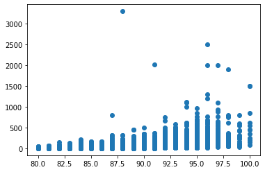
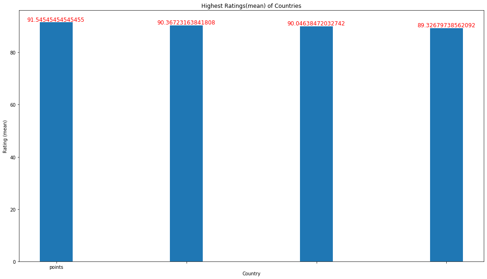
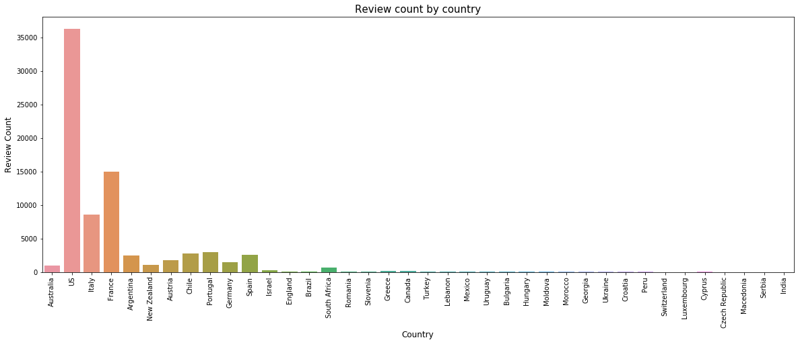
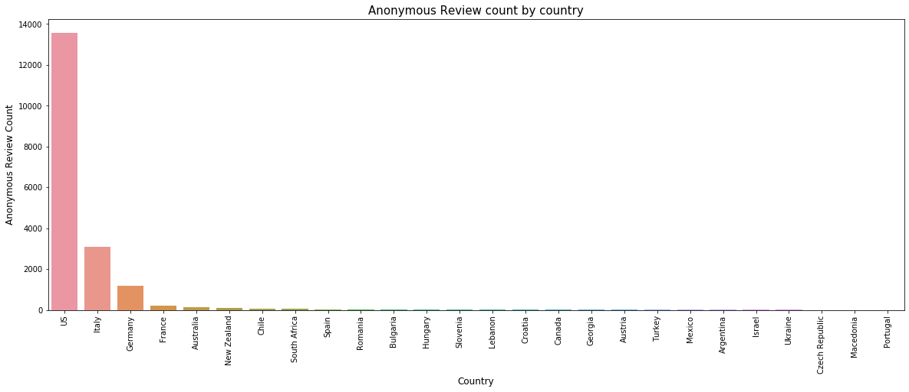

# Wine-Variety-Prediction
Predicting Wine Variety based on Wine Reviews

> Dataset is taken from [kaggle](https://www.kaggle.com/zynicide/wine-reviews) : (*HOWEVER, this repository consists of a different train and test set as it is required for a submission*)

## The Wine Land

> This dataset is an imbalanced dataset consisting of over 28 varieties of wine and *82,687* reviews of different wines

### Prediction of wine variety
    * Model used : SVM classifier
    
    * Features Used for training: Columns `review_description` and `review_title`
    
    * Accuracy attained: 96.3% on the training set
    
    *Parameters Used (Hypertuning): `C= , gamma= , kernel=`
    
### Insights from Data

1. Correlation coefficient between Price and Points is 0.44, signifying moderate strength. The scatter plot clears shows a positive direction

2. The top rated wineries, countries and varities are

| Countries        | Wineries           | Varieties  |
| ---------------- |:------------------:| -----:|
| England          | Araujo             | Nebbiolo |
| Australia        | Ovid               | Gruner Veltliner |
| Germany          | J.L. Chave         | Champagne Blend |

3. The graph of countries by review is as follows:

4. The notion that top varieties of wine come from the topmost wineries is possibly false as either of the top 3 rated varieties of wine are not grown in the top rated winery "Araujo"

5. Most number of anonymous reviews have been registered on wines originating from the USA

